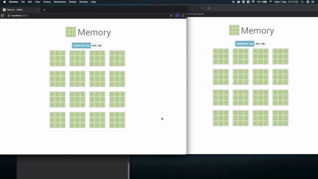

# Memory with Socket.IO 

Play the game Memory/Concentration with your friends!

## Demonstration


**Video demonstration:** [https://youtu.be/tp2uodBT2xk](https://youtu.be/tp2uodBT2xk)

# Info

**Status:** Abandoned project. Felt that I reached my goal.

**Date:** Summer 2018

**Project idea:** Inspired by .IO websites. Create a Room and invite your friends to play the game concentration by using a link.

**Goal/Reason:** This project was developed to introduce myself to technologies such as Sockets, NodeJS. New back-end technologies that is not PHP.

**Used technologies** Express, Socket.IO, NodeJS.

**Additional libraries:** JQuery, Animation.CSS.

**Host:** Hosted the project for a few days with the webservice Digital Ocean. Wanted to learn how to setup a simple VPS.


# how to use

In ./src/memorynode download relevant technologies in:
```
  npm install express socket.io
```
Run:
```
  node app.js
```
Visit:

[http://localhost:3000/](http://localhost:3000/)

